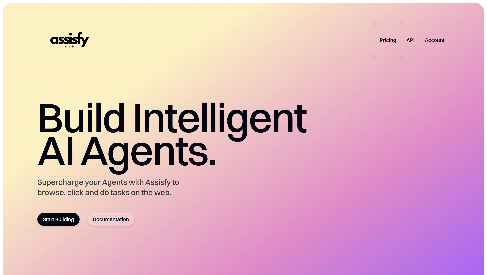

# Assisfy SDK

The Assisfy SDK allows developers to integrate Assisfy's AI capabilities into their applications. This SDK provides a simple interface to create and manage sessions, handle events, and interact with external resources.



## Installation

To install the Assisfy SDK, use npm:

```bash
npm install assisfy-sdk
```

## Generating API Keys

To use the Assisfy SDK, you need to generate an API key from the Assisfy platform. Follow these steps:

1. Visit [Assisfy Platform](https://app.assisfy.ai).
2. Onboard your agent by following the platform's instructions.
3. Navigate to the "API Key" tab.
4. Copy the generated API key for use in your application.

## Usage

Below is an example of how to use the Assisfy SDK to create a session and handle various events.

```javascript
const sdk = require('assisfy-sdk');

const assisfy = new sdk({
    apiKey: "your-api-key-here",
    environment: "production", // or "development"
});

const asyncTest = async () => {
    const session = await assisfy.session().create({
        goal: "Who is the president of the United States?",
    });

    session.on('session_created', (data) => {
        console.log('session_created', data);
    });

    session.on('session_connected', (data) => {
        console.log('session_connected', data);
    });

    session.on('session_error', (data) => {
        console.log('session_error', data);
    });

    session.on('session_disconnected', (data) => {
        console.log('session_disconnected', data);
    });

    session.on('message', (data) => {
        console.log('message', data);
        if (data.event === 'complete') {
            console.dir(data.data.cost_summary, { depth: null });
        }

        if (data.event === 'external_resource_requested') {
            console.log('external_resource_requested', data.data);
            if (data.data.resource_type === 'admin_permission_request') {
                session.handlePermissionRequest(true);
            }
            if (data.data.resource_type === 'request_user_input') {
                session.handleInput('test');
            }
        }
    });
}

asyncTest();
```

## API Reference

### Initialization

To initialize the SDK, create a new instance with your API key and environment:

```javascript
const assisfy = new sdk({
    apiKey: "your-api-key-here",
    environment: "production", // or "development"
});
```

### Creating a Session

To create a session, use the `create` method with a goal:

```javascript
const session = await assisfy.session().create({
    goal: "Your goal here",
});
```

### Event Handling

The session object emits several events that you can listen to:

- `session_created`: Fired when a session is successfully created.
- `session_connected`: Fired when a session is connected.
- `session_error`: Fired when there is an error in the session.
- `session_disconnected`: Fired when a session is disconnected.
- `message`: Fired when a message is received. This event can include sub-events like `complete` and `external_resource_requested`.

### Handling External Resources

When a message event with `external_resource_requested` is received, you can handle it by checking the `resource_type` and responding accordingly:

```javascript
if (data.data.resource_type === 'admin_permission_request') {
    session.handlePermissionRequest(true);
}
if (data.data.resource_type === 'request_user_input') {
    session.handleInput('your-input-here');
}
```

## License

This SDK is licensed under the MIT License. See the LICENSE file for more information.

## Contributing

Contributions are welcome! Please open an issue or submit a pull request on GitHub.

## Support

For support, please contact [support@assisfy.ai](mailto:support@assisfy.ai).
